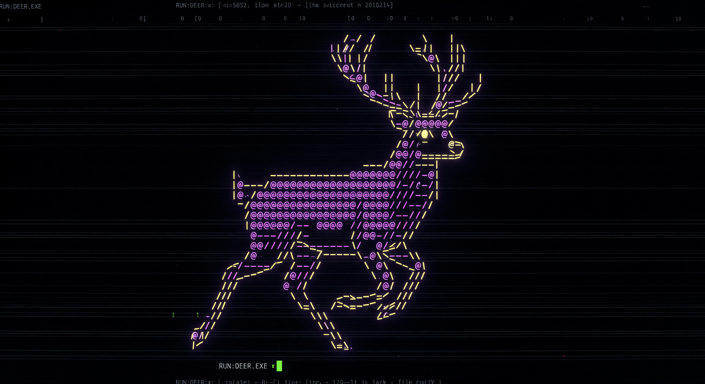
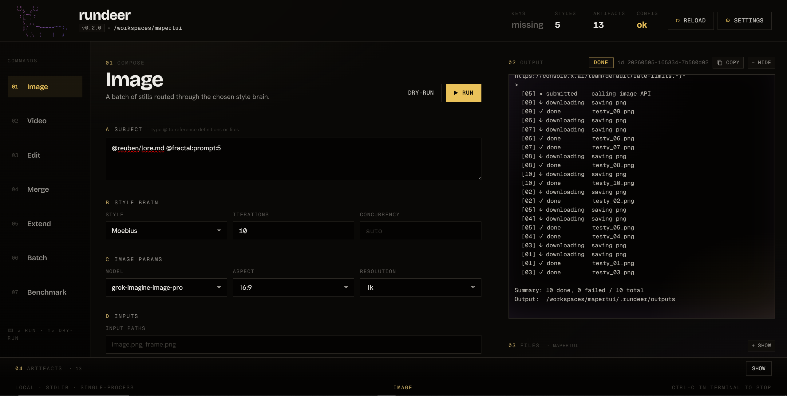

<div align="center">
    
    <h1>rundeer</h1>
    <p><strong>Batch-first AI image and video generation for artists, prompt engineers, and visual workflow hackers.</strong></p>
    <p>
        <a href="#quickstart"></a>
        <a href="#requirements"></a>
        <a href="#commands"></a>
        <a href="#testing"></a>
        <a href="#commands"></a>
    </p>
    <p>
        <a href="#quickstart">Quickstart</a> /
        <a href="#commands">Commands</a> /
        <a href="#configuration">Configuration</a> /
        <a href="#advanced-workflows">Advanced Workflows</a> /
        <a href="#testing">Testing</a>
    </p>
</div>

`rundeer` is a CLI-backed visual workbench for AI image and video generation. It turns a single creative direction into repeatable batches, keeps style prompts and references organized, lets you wire runs as node graphs in the browser, and saves everything into a predictable local workspace.

It is built for iteration: sketch a workflow as nodes, dry-run the plan, generate more than one thing, inspect the artifacts, keep the strongest output, then edit, merge, extend, benchmark, loop, or run the next graph.

|  |  |
|---|---|
| Node workbench | Build image, video, edit, merge, extend, prompt, loop, and preview workflows as a browser graph. |
| Batch generation | Run many image or video jobs from one prompt with concurrency, dry-runs, grids, and indexed output names. |
| Style brains | Store reusable style prompts under `brain/`, attach reference images by numeric id, and keep subject text separate from house style. |
| Full media loop | Generate images, generate videos, animate a start frame, edit images, edit videos, merge up to five images, and extend existing clips. |
| Explore and preview | Browse project files, generated artifacts, configs, logs, images, videos, JSON, and text from the web UI. |
| CLI-backed execution | Use the same command engine from node graphs, dry-runs, curses TUI, plain logs, or the legacy `/classic` form UI. |
| Reproducible workspace | Auto-bootstrap `.rundeer/` with config, web run configs, outputs, cache, logs, benchmark templates, and a reusable agent skill. |
| Research hooks | Score spatial accuracy with a built-in position benchmark that writes JSON logs and CSV summaries. |

## Quickstart

<div align="center">
    
</div>

```bash
# clone repo
git clone https://github.com/nicolaiprodromov/rundeer.git
cd rundeer

# fill in the env file with your own api keys
cp .env.example .env

# install rundeer
./rundeer.sh or ./rundeer.bat

# launch the node workbench and file explorer
rundeer web --open

# or inspect a CLI plan without spending API credits
rundeer image --subject="a quiet station at sunrise" --dry-run --no-tui
```

The first CLI or web command creates `.rundeer/` in the current directory. Outputs default to `.rundeer/outputs`, encoded references are cached in `.rundeer/cache`, web-triggered run configs are written to `.rundeer/web/runs/<run-id>/config.json`, and logs live under `.rundeer/logs`.

Use `--dry-run` whenever you want to inspect the resolved prompt, job count, output paths, references, and definitions without spending API credits:

```bash
rundeer video --style=Moebius --subject="a station at sunrise" --motion="slow dolly in" --iterations=3 --dry-run --no-tui
```

## Commands

| Want to... | Run |
|---|---|
| Generate a batch of images | `python3 rundeer.py image` |
| Generate text-to-video or image-to-video | `python3 rundeer.py video` |
| Edit an image or video | `python3 rundeer.py edit --type=image` or `--type=video` |
| Compose several images into one | `python3 rundeer.py merge` |
| Continue an existing video clip | `python3 rundeer.py extend` |
| Execute many configs in sequence | `python3 rundeer.py batch` |
| Build node graphs and browse artifacts | `python3 rundeer.py web --open` |
| Run a model placement benchmark | `python3 rundeer.py benchmark position` |

### Web Workbench

`rundeer web --open` starts the modern browser workbench. The default app serves the same UI at `/`, `/nodes`, and `/explore`; the older form-based UI is still available at `/classic` as a fallback.

The **Nodes** view is a Blender-style graph editor. The palette includes:

| Category | Nodes |
|---|---|
| Primitives | String, Number, Image File, Video File, File Path, Reroute, String Join, Compress Image, Math, String Op |
| Prompt | Prompt Filter, Definition |
| Commands | Image, Video, Edit, Merge, Extend |
| Loop | Loop · Decompose, Loop · Output |
| Output | Preview |

Command nodes expose their props as sockets, so graph edges can override static fields like subject, style, iterations, output name, or reference ids. Prompt Filter nodes accept multiple context images, letting a language model rewrite a prompt using visual information from upstream image files or generated outputs. Runs with more than one iteration produce bundles; Loop · Decompose and Loop · Output let you fan out a bundle, process each item, and collect the results again. Preview nodes display upstream image, video, or text values inline and can collapse their upstream chain for a cleaner graph.

Graph execution resolves terminal command and preview nodes, calls `/api/plan` for dry-runs or `/api/run` for live runs, then polls the run record until it finishes. Web-triggered runs use the same Python CLI code as terminal commands and keep each generated config under `.rundeer/web/runs/`.

The **Explore** view is a split-pane file browser and previewer for the current project. It can filter the workspace tree, open files in a separate tab, copy paths, and preview supported images, videos, JSON, text, Markdown, logs, CSV, and Python files. The Runs panel shows recent in-memory web runs and their output tails.

### Image Batch

```bash
python3 rundeer.py image \
    --style=Moebius \
    --subject="a lunar botanist repairing a glass greenhouse" \
    --reference=0,3,7 \
    --iterations=8 \
    --aspect-ratio=1:1 \
    --resolution=2k \
    --grid
```

`--reference` selects images from `brain/<Style>/Reference/` by filename prefix, such as `0003_*.png`. References are treated as style references, not content instructions.

### Video Batch

```bash
python3 rundeer.py video \
    --style=Moebius \
    --subject="a quiet marketplace suspended above the clouds" \
    --motion="wide establishing shot, then a slow push toward the main bridge" \
    --duration=6 \
    --resolution=720p \
    --aspect-ratio=16:9 \
    --iterations=3
```

For image-to-video, pass an exact first frame. The API does not allow start-frame mode and reference-image mode at the same time, so rundeer ignores references when `--start-frame` is present.

```bash
python3 rundeer.py video \
    --style=Moebius \
    --subject="the still frame comes alive" \
    --start-frame=./frames/hero.png \
    --motion="subtle wind, drifting dust, restrained camera movement" \
    --duration=6
```

### Edits And Merges

```bash
python3 rundeer.py edit --type=image \
    --input=./input/portrait.png \
    --style=Moebius \
    --subject="turn the jacket into polished chrome, keep the pose intact" \
    --iterations=4 \
    --grid
```

```bash
python3 rundeer.py merge \
    --input=./character.png,./environment.png \
    --subject="place the character naturally into the environment with matched light" \
    --aspect-ratio=16:9 \
    --iterations=5
```

Image edits and merges can send at most five images total. rundeer checks that up front so an invalid run fails before the API call.

### Video Extension

```bash
python3 rundeer.py extend \
    --source=./clips/shot_01.mp4 \
    --subject="the camera pulls back to reveal the full skyline" \
    --motion="continue the same movement, preserve continuity" \
    --duration=6
```

`--source` accepts a local video path or a remote URL.

## Configuration

CLI flags win over config files. If no config path is provided, rundeer reads `.rundeer/config.json` in the current directory. Relative output paths resolve from that same project root.

```json
{
    "style": "Moebius",
    "subject": "a deer-shaped courier in a ruined city",
    "motion": "slow cinematic pan",
    "input": null,
    "output": {
        "dir": ".rundeer/outputs",
        "name": "output"
    },
    "batch": {
        "iterations": 5,
        "concurrency": null,
        "grid": true,
        "grid_only": false,
        "grid_options": {
            "rows": "auto",
            "columns": "auto",
            "padding": 10,
            "bg_color": "#000000"
        },
        "chain": false,
        "chain_compose": false,
        "chain_threshold": 12,
        "chain_override": 50,
        "chain_dilate": 6,
        "chain_feather": 8,
        "chain_min_region": 64
    },
    "references": {
        "ids": [0, 3],
        "pad": true,
        "quality": 85
    },
    "image": {
        "model": "your-image-model",
        "aspect_ratio": "1:1",
        "resolution": "1k"
    },
    "video": {
        "model": "your-video-model",
        "aspect_ratio": "16:9",
        "duration": 6,
        "resolution": "720p",
        "concurrency": 1,
        "output_dir": null
    },
    "rate_limits": {
        "enabled": false,
        "per_second": null,
        "per_minute": null,
        "per_hour": null,
        "per_day": null
    },
    "web": {
        "artifact_view": "grid",
        "artifact_size": "md",
        "dock_expanded": false,
        "output_open_on_run": true,
        "output_panel_open": true,
        "files_panel_open": true,
        "artifacts_panel_open": true
    }
}
```

rundeer loads environment values only from the project-root `.env` file. It does not read parent `.env` files, or `.rundeer/.env`. Use `VISION_API_KEY` for image and video generation, `MODEL_API_KEY` for definition scripts and Prompt Filter nodes that call language models, and `BASE_URL` as the shared API endpoint. `BASE_URL` may be the API root (`https://api.x.ai`) or the OpenAI-compatible base (`https://api.x.ai/v1`); rundeer normalizes the final path per call.

## Styles And References

A style brain is a folder under `brain/` with a Markdown prompt named after the style. The prompt can use `[subject]` and `[motion]` placeholders, while reference images live in `Reference/` and are selected by numeric prefix.

## Advanced Workflows

### Node Graphs

The web workbench can express workflows that are awkward as one shell command: prompt transforms, reusable file/path nodes, command chains, compressed intermediate images, loops over bundles, and inline previews. Save and load graph JSON from the bottom toolbar, or rely on local autosave while iterating.

Use CLI `--dry-run --no-tui` or the `/api/plan` endpoint when you want the generated plan without spending credits. Graph command nodes call `/api/run` and stream status into the run dock.

### Dynamic Definitions

Config files can map `@name` tokens to local Python functions. rundeer resolves those tokens just before each job executes, so definitions can introduce per-job variation or call external services.

```json
{
    "subject": "a symbolic artifact called @random_symbol, expanded with @fractal:prompt:3",
    "definitions": {
        "random_symbol": ".rundeer/def/random_symbol.py",
        "fractal": ".rundeer/def/fractal.py"
    }
}
```

Definition functions read secrets from the environment after the local `.env` file is loaded, so project secrets stay beside the config that uses them.

### Chained Edits

Set `batch.chain` to `true` to feed each edit result into the next iteration. For image edits, `batch.chain_compose` can preserve untouched pixels with mask-based compositing, reducing drift during long edit chains.

### Batch Files

`rundeer batch` reads `.rundeer/batch.json` or `--batch-file=<path>` and runs each listed config in order. Entries may be strings or objects with `config` and `command` fields.

```json
{
    "sleep": 60,
    "batch": [
        { "command": "image", "config": "runs/lookdev_01.json" },
        { "command": "video", "config": "runs/shot_01.json" }
    ]
}
```

## Benchmark

`rundeer benchmark position` renders deterministic reference images, asks the configured image model to reproduce them from a prompt template, then scores the result with SSIM, centroid position error, size ratio, IoU, and color fidelity. Per-iteration JSON logs and CSV summaries are written under `.rundeer/logs/benchmark/position/`.

```bash
python3 rundeer.py benchmark position --dry-run
```

## Requirements

- Python 3.10 or newer.
- A provider API key in the local `.env` file for real generation calls.
- `ffmpeg` for video grids. Individual video outputs still download without it.
- Python dependencies from `requirements.txt`: `docopt`, `Pillow`, `requests`, `numpy`, `scikit-image`, and the provider SDK.

## Testing

```bash
python3 -m pytest
```

The live smoke test is opt-in because it calls the real API. Set credentials in `.env`, then:

```bash
RUNDEER_LIVE=1 python3 -m pytest -m live tests/test_live_smoke.py
```

## Contributing

Keep changes small, testable, and aligned with the CLI-backed workflow. For feature work, add focused tests under `tests/` and verify the relevant command or graph path with `--dry-run` before calling the live API.
